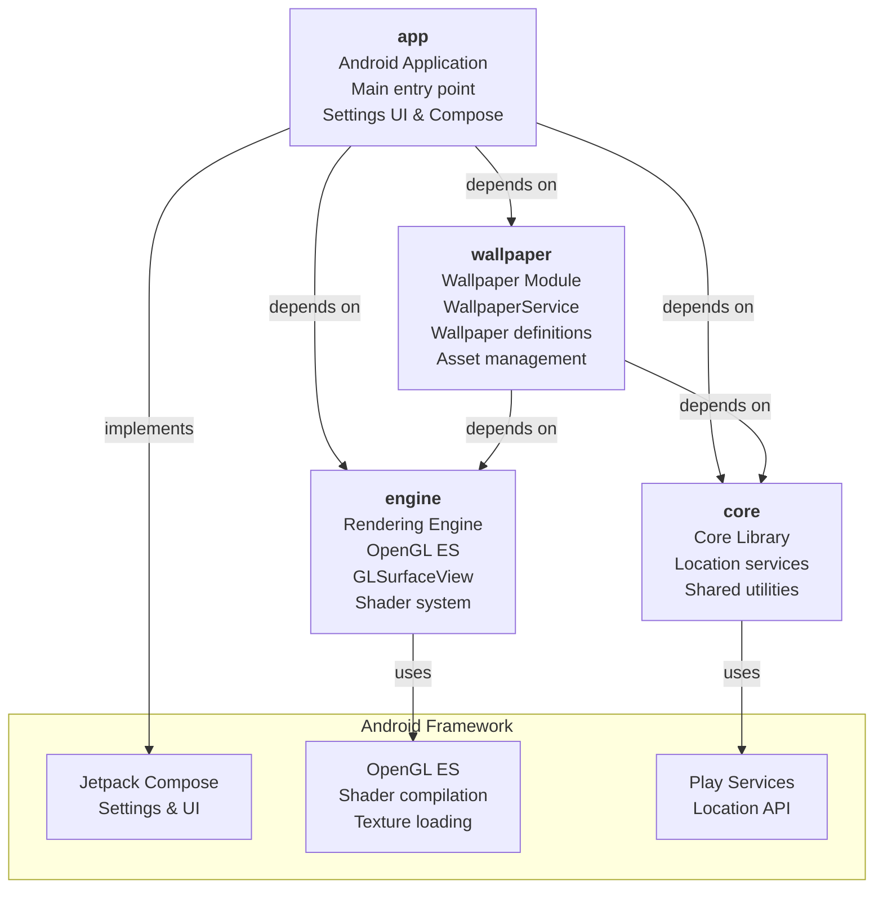
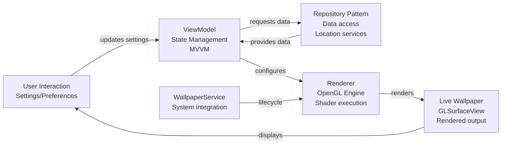
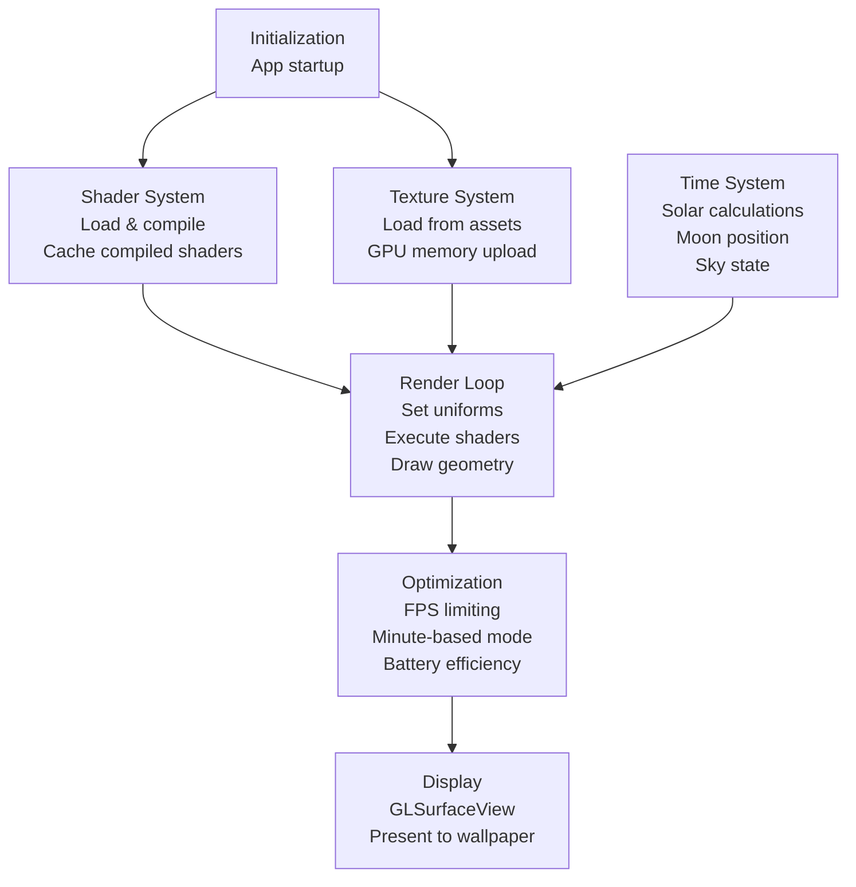
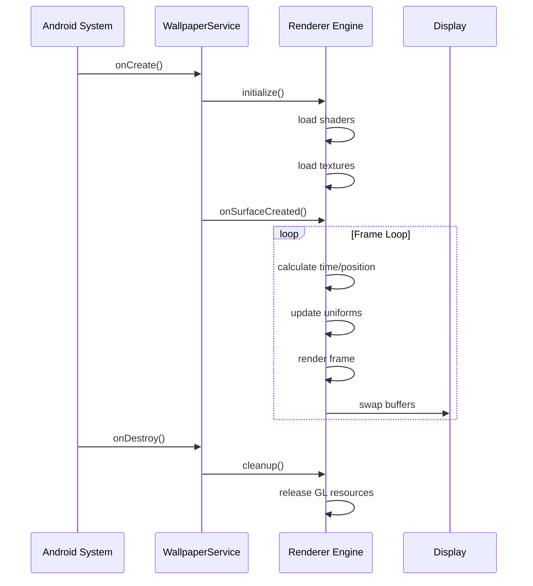

# Lumisky Architecture Overview

## Project Type

**Lumisky** is a production-grade Android live wallpaper application built with:
- **Language**: Kotlin
- **Architecture**: MVVM with Repository pattern
- **UI Framework**: Jetpack Compose
- **Rendering**: OpenGL ES with GLSurfaceView
- **Minimum SDK**: 28
- **Target SDK**: 36

## Module Structure

Lumisky is organized as a multi-module Gradle project with four core modules:



## Component Architecture

### 1. **app** Module
- **Purpose**: Main Android application module, UI presentation layer
- **Key Features**:
  - Settings UI (Jetpack Compose)
  - Wallpaper preview screens
  - Application entry points
  - Firebase integration (Crashlytics, Analytics)
  - Google Play integration

### 2. **core** Module
- **Purpose**: Shared utilities and cross-cutting concerns
- **Key Responsibilities**:
  - Location services (geographic position for sun/moon calculations)
  - Utility functions
  - Core data models
- **Dependencies**:
  - Play Services Location
  - AndroidX Core KTX

### 3. **engine** Module
- **Purpose**: Graphics rendering and wallpaper logic engine
- **Key Responsibilities**:
  - OpenGL ES rendering pipeline
  - GLSurfaceView lifecycle management
  - EGL context management
  - Shader compilation and caching
  - Texture loading and management
  - Renderer state and FPS optimization
  - Minute-based rendering mode for battery efficiency
- **Technical Details**:
  - Handles continuous rendering for interactive wallpapers
  - Manages preview rendering mode
  - Implements low-battery wallpaper behavior
  - Preserves celestial motion continuity (sun/moon positioning)

### 4. **wallpaper** Module
- **Purpose**: Wallpaper service and definition layer
- **Key Responsibilities**:
  - WallpaperService implementation
  - Modular wallpaper configurations
  - Shader-based wallpaper definitions
  - Static image/texture layers
  - Time-based sky and effect systems
  - Preview and thumbnail generation
  - Asset preprocessing (image normalization, WebP conversion)

## Data Flow Architecture



## Build System

### Gradle Configuration
- **Build Tool**: Gradle 8.x with Kotlin DSL
- **Plugin Management**: Centralized through `settings.gradle.kts`
- **Dependency Management**: Centralized through version catalogs (libs)

### Key Gradle Tasks
- **Asset Processing**:
  - `syncZenithPreviewAssets` - Normalizes zenith snapshots, converts to WebP
  - `convertWallpaperTexturesToWebp` - Converts PNG/JPG textures to WebP
  - `generateDerivedWallpaperAssets` - Preprocesses and creates texture variants

- **Validation**:
  - `validatePlayReleaseConfig` - Verifies release signing configuration
  - `validateShaderCelestialMotionContinuity` - Ensures shader correctness

- **Deployment**:
  - `deployDebugToConnectedDevice` - Installs and launches debug build
  - `enablePhoneAutoRun` / `disablePhoneAutoRun` - Local development preferences

## Rendering Pipeline



## Key Features

### Celestial Motion System
- Real-time sun and moon positioning based on location and time
- Continuous smooth motion across the sky
- Sky color transitions based on solar zenith angle
- Prevents discontinuous jumps (validates shader logic)

### Asset Management
- Automated WebP conversion for textures and previews
- Transparent edge bleeding and feathering for smooth rendering
- Derived asset generation at build time
- Zenith snapshot preprocessing

### Performance Optimization
- Minute-based rendering mode (render only when minute changes)
- FPS limiting for reduced power consumption
- Low-battery wallpaper behavior
- Modular wallpaper definitions for flexible configuration

### Graphics Pipeline
- OpenGL ES rendering with custom shaders
- EGL context management
- Texture and shader caching
- Preview rendering mode separation

## Module Dependencies

```mermaid
graph TB
    App["app<br/>Android App"]
    Core["core<br/>Utilities"]
    Engine["engine<br/>Graphics"]
    Wallpaper["wallpaper<br/>Service"]
    
    App -->|depends| Core
    App -->|depends| Engine
    App -->|depends| Wallpaper
    
    Wallpaper -->|depends| Engine
    Wallpaper -->|depends| Core
    
    Engine -->|independent|  
    Core -->|independent|
    
    style App fill:#e1f5ff
    style Core fill:#f3e5f5
    style Engine fill:#fff3e0
    style Wallpaper fill:#e8f5e9
```

## Technology Stack

| Component | Technology | Version |
|-----------|-----------|---------|
| Build System | Gradle KTS | 8.x |
| Kotlin | Language | 2.x |
| Android API | Minimum | 28 |
| Android API | Target | 36 |
| UI Framework | Jetpack Compose | Latest |
| Graphics | OpenGL ES | 3.0+ |
| Location | Play Services | Latest |
| Crash Reporting | Firebase Crashlytics | Latest |
| Analytics | Firebase Analytics | Latest |

## Key Design Principles

1. **Modular Architecture**: Clear separation of concerns across modules
2. **MVVM Pattern**: Repository-backed ViewModels for state management
3. **Efficient Rendering**: Battery-conscious rendering strategies
4. **Asset Optimization**: Build-time preprocessing to reduce runtime overhead
5. **Scalability**: Support for multiple wallpaper definitions and effects
6. **Correctness**: Validation of celestial motion continuity and rendering accuracy

## Wallpaper Lifecycle



## Build Configuration

### Release Build Process
1. **Validation**: Check Play Store release configuration
2. **Asset Processing**: Convert and optimize all textures and previews
3. **Shader Validation**: Verify celestial motion logic
4. **Compilation**: Build with ProGuard/R8 optimization
5. **Signing**: Sign with release keystore
6. **Resource Shrinking**: Remove unused resources

### Local Development
- Phone auto-run preferences for quick iteration
- Automatic device selection (prefers physical device over emulator)
- Debug APK fast deployment
- Local asset generation

---

*For detailed implementation guidance, see [AGENTS.md](AGENTS.md)*
