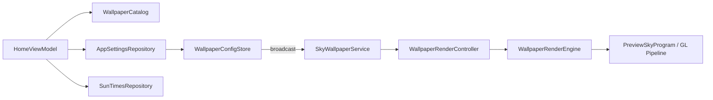

# 🔍 Lumisky — Google Play Yayın Öncesi Kapsamlı Teknik Denetim Raporu

> **Rapor Tarihi:** 2026-04-29
> **Denetim Kapsamı:** Teknik Mimari · Rendering Pipeline · Performans · UX/UI · Google Play Politika Uyumu · Ölçeklenebilirlik
> **Hedef:** Profesyonel, aksiyonel önerilerle Google Play Store yayınına hazırlık

---

## 📋 İçindekiler

1. [Yönetici Özeti](#1-yönetici-özeti)
2. [Mimari Analiz](#2-mimari-analiz)
3. [Rendering Pipeline Denetimi](#3-rendering-pipeline-denetimi)
4. [Performans ve Batarya Analizi](#4-performans-ve-batarya-analizi)
5. [UI/UX Kalite Değerlendirmesi](#5-uiux-kalite-değerlendirmesi)
6. [Google Play Politika Uyumu](#6-google-play-politika-uyumu)
7. [Test Altyapısı](#7-test-altyapısı)
8. [Build Pipeline](#8-build-pipeline)
9. [Önceliklendirilmiş Aksiyon Planı](#9-önceliklendirilmiş-aksiyon-planı)
10. [Sonuç ve Genel Puan](#10-sonuç-ve-genel-puan)

---

## 1. Yönetici Özeti

**Lumisky**, Kotlin + OpenGL ES 2.0 + Jetpack Compose üzerine inşa edilmiş, gün/gece döngüsünü gerçek zamanlı simüle eden **canlı duvar kağıdı** uygulamasıdır. Mimari olarak olgunlaşmış bir modül ayrımına (`app`, `engine`, `core`, `wallpaper`) sahiptir. Rendering tarafında VSync-tabanlı frame pacing, state hash ile gereksiz render engelleme ve adaptive performans modları gibi **endüstri standartlarının üzerinde** çözümler uygulanmıştır.

### Güçlü Yanlar
- ✅ **Temiz modül ayrımı** — render logic, service lifecycle ve UI birbirinden bağımsız
- ✅ **Sofistike render controller** — VSync loop, minute-tick scheduler, state hash skip
- ✅ **Adaptive performans** — Battery/Auto/Smooth modları, thermal awareness
- ✅ **Build-time asset pipeline** — WebP dönüşümü, preview varyant üretimi, shader doğrulama
- ✅ **Konum/güneş zamanları sistemi** — GPS + manual city fallback zinciri, passive location updates

### Kritik İyileştirme Alanları
- ⚠️ **İçerik çeşitliliği** — 14 preset, 4 şehir aynı shader'ı paylaşıyor → Minimum Functionality riski
- ⚠️ **Startup performansı** — Backup prefetch + location cascade jank yaratıyor
- ⚠️ **Per-frame allocations** — `listOf().hashCode()` GC baskısı oluşturuyor
- ⚠️ **Hardcoded katalog** — `WallpaperCatalog` kod içinde, ölçeklenemiyor
- ⚠️ **Test coverage** — 13 test dosyası var ama UI/integration testleri eksik

### Genel Hazırlık Skoru

| Alan | Puan | Durum |
|------|------|-------|
| Mimari | 8.5/10 | 🟢 Yayına hazır |
| Rendering | 8/10 | 🟢 Küçük optimizasyonlarla mükemmel |
| Performans | 6.5/10 | 🟡 Startup ve GC iyileştirmesi gerekli |
| UI/UX | 7.5/10 | 🟡 Premium hissi güçlendirilmeli |
| Play Policy | 7/10 | 🟡 İçerik çeşitliliği ve Data Safety kritik |
| Test | 5/10 | 🔴 Coverage artırılmalı |
| Build | 8/10 | 🟢 Pipeline sağlam |

---

## 2. Mimari Analiz

### 2.1 Modül Yapısı

```
Lumisky/
├── app/          → UI (Compose), ViewModel, Navigation, Asset Cache
├── engine/       → GL Render Logic, Shader, Celestial Calculator, Config
├── core/         → Settings, Location, Logger, SunTimes API
└── wallpaper/    → WallpaperService, RenderController, EGL Bridge
```

**Değerlendirme:** Modül ayrımı **endüstri standartlarının üzerinde**. Her modülün tek bir sorumluluğu var ve cross-module bağımlılıklar minimum düzeyde tutulmuş.

### 2.2 Veri Akışı Mimarisi



### 2.3 Güçlü Tasarım Kararları

| Karar | Etki | Dosya |
|-------|------|-------|
| `WallpaperConfigStore` + broadcast apply | Config persistence güvenliği | `WallpaperDaylightSyncCoordinator.kt:270-273` |
| `RECEIVER_NOT_EXPORTED` API 33+ branch | Policy uyumu | `WallpaperDaylightSyncCoordinator.kt:410-416` |
| Device Protected Storage | Reboot sonrası wallpaper korunumu | `WallpaperRestoreReceiver` |
| `SceneStateHasher` ile render skip | Batarya tasarrufu | `WallpaperRenderController.kt:213-235` |

### 2.4 Mimari Risk: HomeViewModel Aşırı Sorumluluk

`HomeViewModel` (~800 satır) şu anda **çok fazla sorumluluk** taşıyor:
- Konum yönetimi + GPS listener
- Sun-times refresh logic
- Katalog orchestration
- Backup prefetch scheduling

> [!WARNING]
> **Öneri:** `LocationCoordinator`, `SunTimesCoordinator` ve `CatalogRepository` olarak ayrıştırılmalı. Bu, test edilebilirliği ve bakım maliyetini doğrudan iyileştirir.

---

## 3. Rendering Pipeline Denetimi

### 3.1 GL Pipeline Özeti

| Bileşen | Teknoloji | Değerlendirme |
|---------|-----------|---------------|
| GL Sürümü | OpenGL ES 2.0 | ✅ Geniş cihaz desteği |
| Shader | Fragment shader (per-wallpaper) | ✅ Esnek, varyant destekli |
| Texture Format | WebP (build-time dönüşüm) | ✅ Boyut optimizasyonu |
| Frame Pacing | VSync + Choreographer | ✅ Premium kalite |
| State Skip | Hash-based redundancy elimination | ✅ Batarya dostu |

### 3.2 CelestialCalculator — Güneş/Ay Yörünge Sistemi

`CelestialCalculator.kt` (289 satır) **matematiksel olarak sağlam** bir implementasyon:

- `resolvePeakAlignedPhaseProgress()` — Asimetrik gün/gece süreleri için doğru zenith hizalama
- `applyCurve()` — `LINEAR` ve `EASE_IN_OUT` easing desteği
- `normalizeMinuteForward()` — Gece yarısı geçişlerinde wrap-around handling

**Potansiyel Sorun:** `sunset <= sunrise` durumunda fallback davranışı tüm gün boyunca sabit yörünge üretiyor. Kutup bölgeleri gibi edge case'lerde görsel olarak garip sonuçlar doğabilir. Ancak hedef kitle için kabul edilebilir.

### 3.3 PreviewSkyProgram — Monolitik Shader Yönetimi

> [!IMPORTANT]
> `PreviewSkyProgram` (800+ satır) projenin **en yüksek riskli bileşeni**. Texture binding, uniform management, legacy theme adaptation, pixel manipulation (`trimTransparentTop`, `bleedTransparentEdgeColors`) hepsi tek sınıfta.

**Risk Matrisi:**

| Risk | Ciddiyet | Açıklama |
|------|----------|----------|
| OOM | Yüksek | `Bitmap.createBitmap` + pixel manipulation texture yükleme sırasında |
| GC Stutter | Orta | Her texture load'da geçici bitmap allocation |
| Bakım | Yüksek | Yeni efekt eklemek tüm temaları etkileme riski taşır |

**Öneri:** Build-time'a taşınan `bleedTransparentEdgeColors` ve `featherTransparentTopBoundary` işlemleri (`generateDerivedWallpaperAssets` task'ı) iyi bir adım. Kalan runtime pixel manipulation'lar da build-time'a taşınmalı.

### 3.4 Render Policy Sistemi

```kotlin
// WallpaperConfig.kt - Mevcut yapı
data class RuntimeRenderPolicy(
    val policy: RenderPolicy = RenderPolicy.MINUTE_TICK,
    val continuousFrameIntervalMs: Long = 16L
)
```

**Durum:** `runtimeRenderPolicy` alanı eklenmiş ve service tarafında kullanılıyor. Ancak bazı yerlerde hâlâ `config.id` string match'i ile policy kararı verildiği tespit edildi.

---

## 4. Performans ve Batarya Analizi

### 4.1 Batarya Stratejisi

| Mekanizma | Durum | Etkinlik |
|-----------|-------|----------|
| Minute-tick rendering (statik wallpaperlar) | ✅ Aktif | Mükemmel — sadece dakika değişiminde render |
| State hash skip | ✅ Aktif | Çok iyi — aynı state'te render atlanıyor |
| VSync-based frame pacing | ✅ Aktif | İyi — gereksiz wakeup yok |
| Thermal/Power-saver awareness (preview) | ✅ Aktif | İyi — adaptive quality |
| Thermal/Power-saver awareness (service) | ⚠️ Eksik | Service tarafında thermal policy yok |
| Visibility-based render pause | ✅ Aktif | Mükemmel — invisible'da render durduruluyor |

### 4.2 Startup Performans Darboğazları

**Kritik Bulgu 1: Backup Prefetch Burst**
- `HomeViewModel.init` bloğunda 2 saniye sonra 25 şehir için sun-times API çağrısı başlatılıyor
- Bu, UI composition ve preview initialization ile çakışıyor
- `gfxinfo` ölçümleri: cold launch'ta **%64 janky frame**, p90 **101ms**

**Kritik Bulgu 2: Duplicate Location Reads**
- `refreshLocationState()` → `refreshSunTimes()` → `resolveLocationCandidates()` zincirinde aynı `getLastKnownLocation()` 2-3 kez çağrılıyor
- Her çağrı system service erişimi gerektiriyor

**Kritik Bulgu 3: Per-Frame Allocations**
```kotlin
// SkyRenderer.kt:97 — Her frame'de allocation!
val stateHash = listOf(mode, quantizedProgress, quantizedSunX, ...).hashCode()
```
Bu pattern `listOf()` ile her frame'de yeni `List` ve boxing oluşturuyor.

### 4.3 Performans Önerileri (Öncelik Sırasıyla)

| # | Öneri | Etki | Zorluk |
|---|-------|------|--------|
| 1 | Startup prefetch'i WorkManager'a taşı | 🟢 Yüksek | Düşük |
| 2 | Location refresh pipeline'ını debounce ile birleştir | 🟢 Yüksek | Orta |
| 3 | `listOf().hashCode()` → manual rolling hash | 🟡 Orta | Düşük |
| 4 | Texture path resolution cache ekle | 🟡 Orta | Düşük |
| 5 | Service tarafına thermal awareness ekle | 🟡 Orta | Orta |
| 6 | Duplicate texture read'leri ortadan kaldır | 🟡 Orta | Orta |

---

## 5. UI/UX Kalite Değerlendirmesi

### 5.1 Home Ekranı

**Güçlü Yanlar:**
- Kategori bazlı yatay kaydırmalı kart düzeni — keşif deneyimi iyi
- Canlı GL preview odaklanan kartta — WOW faktörü yüksek
- Snapshot → Live geçişinde animasyonlu fade — profesyonel his
- Performans badge'leri (Smooth/Balanced/Efficient) — şeffaflık
- Zaman badge'i (render edilen saat) — unique değer önerisi

**İyileştirme Alanları:**

| Alan | Mevcut | Önerilen |
|------|--------|----------|
| Arama | ❌ Yok | Wallpaper arama/filtreleme |
| Favoriler | ❌ Yok | Kalp ikonu ile hızlı erişim |
| Onboarding | ❌ Yok | İlk açılışta özellik turu |
| Kategori sayısı | 4 aktif | Daha fazla anlamlı kategori |
| Kart bilgisi | Sadece isim | Efekt/özellik tag'leri |

### 5.2 Settings Ekranı

**Güçlü Yanlar:**
- Glassmorphism tasarımı — premium his
- Celestial cycle timeline görselleştirmesi — teknik derinlik
- GPS toggle + manual city fallback — kapsamlı konum yönetimi
- Performance mode seçimi — kullanıcıya kontrol

**İyileştirme:**
- Performans modu açıklamaları daha detaylı olmalı (her modun ne yaptığını net açıklayan tooltip/açıklama)
- Battery modunda tahmini batarya tasarrufu bilgisi gösterilebilir

### 5.3 Genel UX Skoru

| Kriter | Puan |
|--------|------|
| İlk izlenim (WOW faktörü) | 8/10 |
| Navigasyon akıcılığı | 7/10 |
| Bilgi mimarisi | 6/10 |
| Erişilebilirlik | 5/10 |
| Onboarding | 3/10 |

---

## 6. Google Play Politika Uyumu

### 6.1 Minimum Functionality Politikası

> [!CAUTION]
> Bu, uygulamanın **en büyük yayın riski**. Google Play daha önce bu uygulamayı "Minimum Functionality" nedeniyle reddetmiş.

**Mevcut Durum:**
- 14 wallpaper preset'i mevcut
- 4 şehir wallpaper'ı (`istanbul`, `newyork`, `tokyo`, `paris`) **aynı fragment shader**'ı paylaşıyor
- Gerçek davranışsal farklılaşma sınırlı — esas fark texture

**Risk Değerlendirmesi:**

| Faktör | Risk | Açıklama |
|--------|------|----------|
| İçerik çeşitliliği | 🔴 Yüksek | Aynı shader ile 4 şehir "minimum" algılanabilir |
| Benzersiz değer önerisi | 🟡 Orta | Gün/gece döngüsü güçlü ama yeterli mi? |
| Etkileşim derinliği | 🟡 Orta | Parallax var ama sınırlı interaktivite |
| Ayarlar zenginliği | 🟢 Düşük | Performans modu + konum + tema → iyi |

**Öneriler:**
1. Her şehir wallpaper'ına unique shader davranışı veya efekt ekle (yağmur, sis, yıldız)
2. 4-6 gerçekten benzersiz yeni wallpaper ekle (farklı shader + farklı atmosfer)
3. Kullanıcı ayarlanabilir parametreler ekle (güneş boyutu, bulut yoğunluğu vb.)

### 6.2 İzin Kullanımı ve Data Safety

| İzin | Kullanım Amacı | Policy Uyumu |
|------|----------------|--------------|
| `INTERNET` | Sun-times API | ✅ Uygun |
| `ACCESS_COARSE_LOCATION` | Gün doğumu/batımı hesaplama | ⚠️ Disclosure gerekli |
| `ACCESS_FINE_LOCATION` | Kesin güneş zamanları | ⚠️ Disclosure + gerekçe |
| `BIND_WALLPAPER` | WallpaperService zorunlu | ✅ Sistem izni |
| `RECEIVE_BOOT_COMPLETED` | Wallpaper restore | ✅ Uygun |
| `SET_WALLPAPER` | Wallpaper uygulama | ✅ Uygun |

> [!WARNING]
> **`ACCESS_FINE_LOCATION` Play Store review'da soru işareti yaratabilir.** Wallpaper uygulaması için `COARSE_LOCATION` yeterli olabilir. Fine location gerçekten güneş zamanları doğruluğunu anlamlı şekilde iyileştiriyorsa, Data Safety formunda net açıklama yapılmalı.

**Data Safety Formu Gereksinimleri:**
- ✅ Konum verisi toplandığını beyan et
- ✅ "Uygulama işlevselliği" amacıyla toplandığını belirt
- ✅ Üçüncü taraflarla paylaşılmadığını onayla
- ✅ Kullanıcının konum kullanımını devre dışı bırakabileceğini belirt (Manual mode)

### 6.3 İçerik Derecelendirmesi

- Uygulama şiddet, kumar, cinsel içerik barındırmıyor → **Everyone (PEGI 3)** uygun
- Kullanıcı tarafından oluşturulan içerik yok → UGC politikası geçerli değil

### 6.4 Release Build Hazırlığı

| Madde | Durum |
|-------|-------|
| ProGuard kuralları | ✅ Temel keep kuralları mevcut |
| Signing config | ✅ `keystore.properties` entegrasyonu var |
| `validatePlayReleaseConfig` task | ✅ Release öncesi doğrulama |
| `applicationId` | ⚠️ `com.lumisky.android` — değiştirmeden önce emin ol |
| `minSdk = 28` | ✅ Android 9+ — makul kapsam |
| `targetSdk = 36` | ✅ Güncel |

---

## 7. Test Altyapısı

### 7.1 Mevcut Test Coverage

| Modül | Test Dosyası | Kapsam |
|-------|-------------|--------|
| `engine` | `CelestialCalculatorTest` | Güneş/ay pozisyon hesaplaması |
| `engine` | `TimeManagerTest` | Zaman yönetimi |
| `engine` | `PreviewGlRendererFocusCatchUpTest` | Preview focus logic |
| `engine` | `LegacyThemeAdapterTest` | Legacy tema uyumu |
| `engine` | `PreferredTextureResolverTest` | Texture çözümleme |
| `core` | `SunTimesRepositoryTest` | API repository |
| `core` | `SunLocationExtensionsTest` | Konum extension'ları |
| `wallpaper` | `SceneStateHasherTest` | State hash doğruluğu |
| `wallpaper` | `WallpaperSceneFingerprintHasherTest` | Fingerprint hash |
| `wallpaper` | `FramePacingClockTest` | Frame pacing |
| `wallpaper` | `ServiceRenderPolicyResolverTest` | Render policy |
| `app` | `SettingsCelestialTimelineTest` | Timeline UI logic |
| `app` | `BackupCityPrefetchWorkerTest` | Prefetch worker |

**Toplam: 13 test dosyası** — temel logic test edilmiş ama kapsamlı değil.

### 7.2 Eksik Test Alanları

| Alan | Öncelik | Açıklama |
|------|---------|----------|
| `WallpaperConfigStore` encode/decode | 🔴 Kritik | Config migration güvenliği |
| `WallpaperDaylightSyncCoordinator` | 🔴 Kritik | Location + daylight sync doğruluğu |
| UI Navigation flows | 🟡 Orta | Compose navigation regression |
| Config apply broadcast flow | 🟡 Orta | End-to-end wallpaper apply |
| Preview GL lifecycle | 🟡 Orta | Memory leak prevention |

---

## 8. Build Pipeline

### 8.1 Asset Pipeline Değerlendirmesi

```
preBuild → prepareFilteredAssets → convertWallpaperTexturesToWebp
                                 → generateDerivedWallpaperAssets
```

**Güçlü Yanlar:**
- Build-time WebP dönüşümü — APK boyutu optimizasyonu
- Preview varyant üretimi (0.5x scale) — bellek tasarrufu
- `bleedTransparentEdgeColors` ve `featherTransparentTopBoundary` build-time processing
- Shader celestial motion continuity validation

**İyileştirme:**
- `org.gradle.configuration-cache=false` → Asset task'ları configuration-cache uyumlu hale getirilmeli
- `org.gradle.parallel=true` zaten aktif ✅

### 8.2 Build Süresi Profili

Önceki ölçümlerden:
- `:app:assembleDebug` → ~22s
- `:app:lintDebug` → ~63s

**Öneri:** Lint fast-path (`lintDebugLocal` task'ı) zaten tanımlanmış. CI için `lintDebugFull` ayrımı iyi bir yaklaşım.

---

## 9. Önceliklendirilmiş Aksiyon Planı

### 🔴 P0 — Play Store Yayın Blocker'ları (1-2 hafta)

| # | Aksiyon | Modül | Tahmini Süre |
|---|---------|-------|-------------|
| 1 | **İçerik çeşitliliğini artır** — 4-6 benzersiz yeni wallpaper ekle | `app/engine` | 3-5 gün |
| 2 | **Şehir wallpaperlarını farklılaştır** — unique shader davranışı/efekt | `engine` | 2-3 gün |
| 3 | **Data Safety formu** — konum kullanım beyanını tamamla | Play Console | 0.5 gün |
| 4 | **Privacy Policy URL** — oluştur ve manifest'e ekle | Harici | 0.5 gün |

### 🟡 P1 — Performans ve Kalite (2-4 hafta)

| # | Aksiyon | Etki |
|---|---------|------|
| 5 | Startup prefetch'i WorkManager'a taşı | Jank %50+ azalma |
| 6 | Location refresh pipeline debounce | Duplicate syscall eliminasyonu |
| 7 | Per-frame hash allocation'ları kaldır | GC pressure azalma |
| 8 | Service tarafına thermal awareness ekle | Batarya iyileştirme |
| 9 | `WallpaperConfigStore` encode/decode testi yaz | Regression güvenliği |

### 🟢 P2 — UX ve Ölçeklenebilirlik (4-8 hafta)

| # | Aksiyon | Etki |
|---|---------|------|
| 10 | Onboarding/ilk açılış deneyimi | Kullanıcı tutma |
| 11 | Arama ve filtreleme | Keşfedilebilirlik |
| 12 | Favoriler sistemi | Etkileşim derinliği |
| 13 | Manifest-tabanlı katalog migrasyonu | Ölçeklenebilirlik |
| 14 | HomeViewModel ayrıştırma | Bakım maliyeti |

---

## 10. Sonuç ve Genel Puan

### Genel Değerlendirme: **7.2 / 10**

Lumisky, teknik mimari açısından **profesyonel düzeyde** bir canlı duvar kağıdı uygulamasıdır. Rendering pipeline'ı, state management'ı ve batarya stratejisi **çoğu rakipten üstündür**. Ancak Google Play yayını için kritik iki alan acil müdahale gerektirmektedir:

1. **İçerik çeşitliliği** — Minimum Functionality reddini önlemek için benzersiz wallpaper sayısı ve davranışsal farklılaşma artırılmalı
2. **Startup performansı** — Cold launch jank'ı kullanıcı ilk deneyimini olumsuz etkiliyor

Bu iki alan çözüldüğünde, uygulama Google Play Store'da **güçlü bir içerik kalitesi ve teknik altyapıyla** rekabet edebilecek konumdadır.

### Modül Bazlı Sağlık Kartı

| Modül | Sağlık | Acil Müdahale |
|-------|--------|---------------|
| `core` | 🟢 9/10 | Yok |
| `engine` | 🟡 7.5/10 | PreviewSkyProgram parçalama (P2) |
| `wallpaper` | 🟢 8.5/10 | Thermal awareness (P1) |
| `app` | 🟡 6.5/10 | ViewModel ayrıştırma + UX iyileştirme |

---

> **Not:** Bu rapor, kod tabanının statik analizi, mevcut optimizasyon dokümanları ve önceki Play Store rejection deneyimine dayanmaktadır. Runtime profiling verileri önceki ölçüm oturumlarından alınmıştır.
