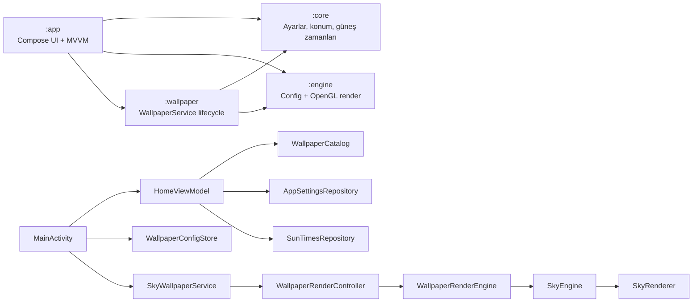
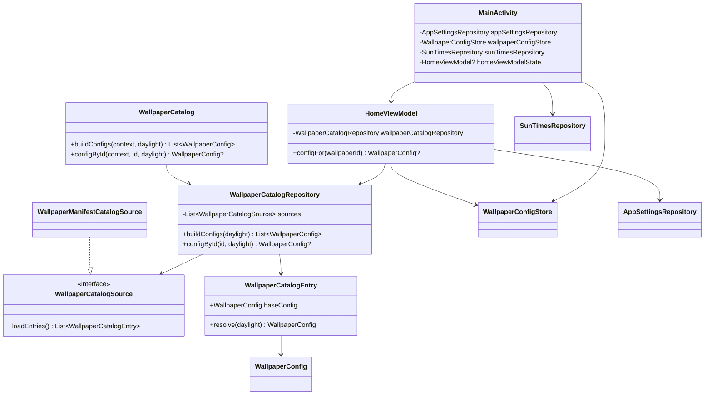
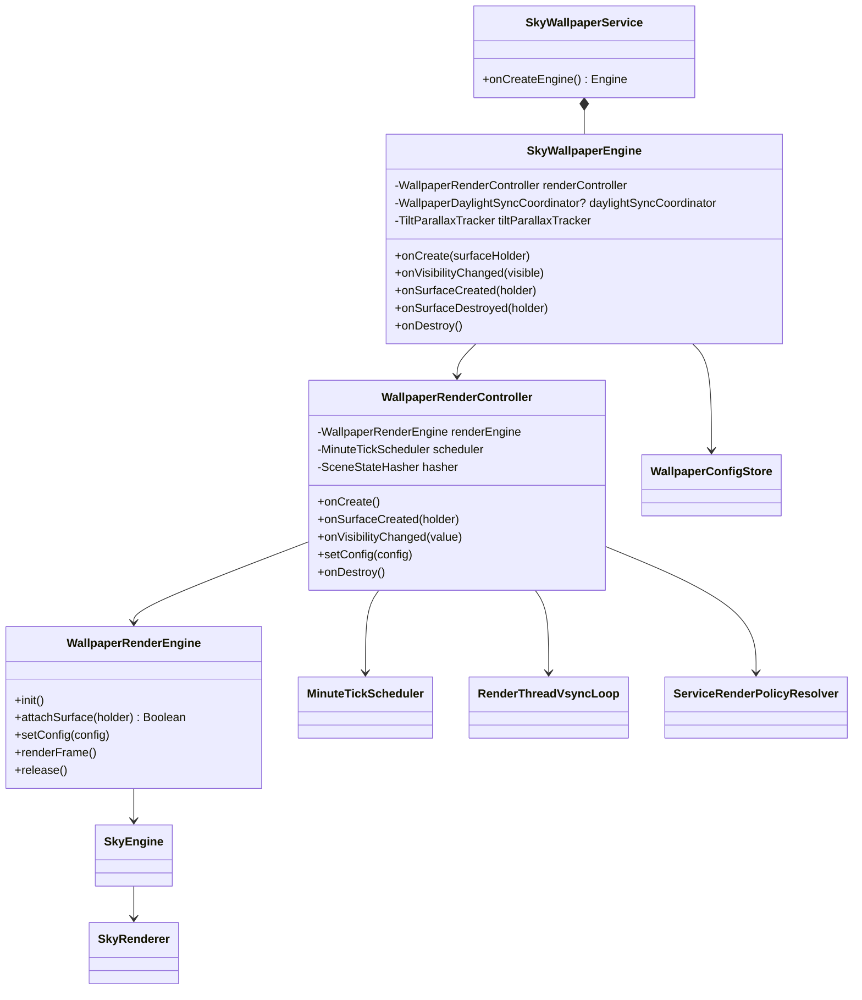
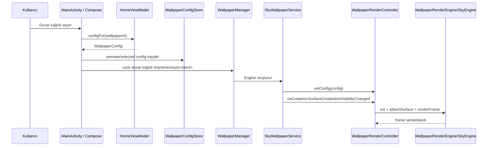

# Lumisky UML Diyagramları

Bu dosya, uygulamanın ana Android/Compose, MVVM, canlı duvar kağıdı ve OpenGL ES render akışlarını Mermaid UML ile özetler.

## Modül / Bileşen Diyagramı

## Ana Sınıf Diyagramı

## Canlı Duvar Kağıdı Render Sınıfları

## Duvar Kağıdı Uygulama Akışı

